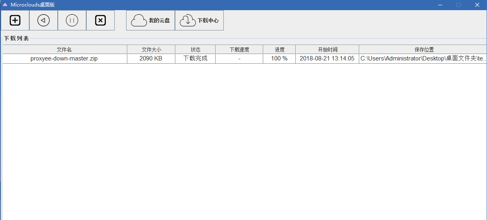
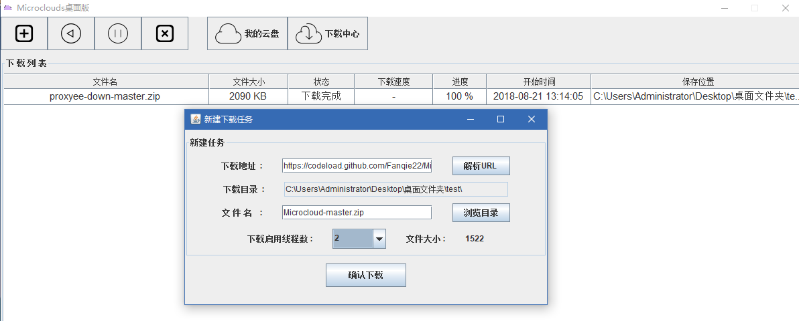
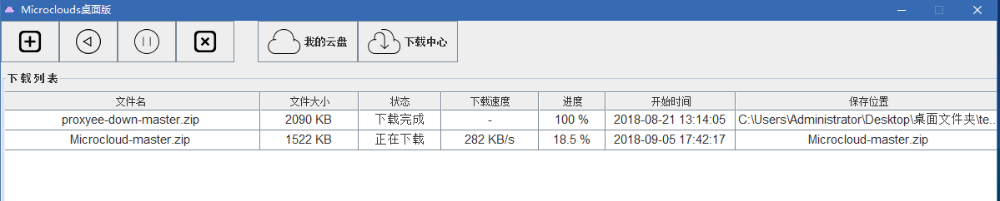

# Microcloud

功能未完善,界面显示有点问题 ,现在全力开发web版本的,web版本完成之后将会继续开发 .

完善之后将和另一个web云盘项目连通数据库,实现多点上传/下载

[web 版地址 : https://github.com/Fanqie22/MicroClouds ]

一个基于Java SE的多线程 ,可断点下载的URL资源下载器(Windows桌面版)
可跟另一个云盘项目MicroClouds(web版)配合管理上传/下载的文件 . (未完成)
核心功能(上传/下载/多线程/断点)已经完成,界面UI交换没有跟进.

主界面 :

添加下载任务页面,先解析URL ,若返回状态码为200 即是有效URL : 

正在下载页面 :

